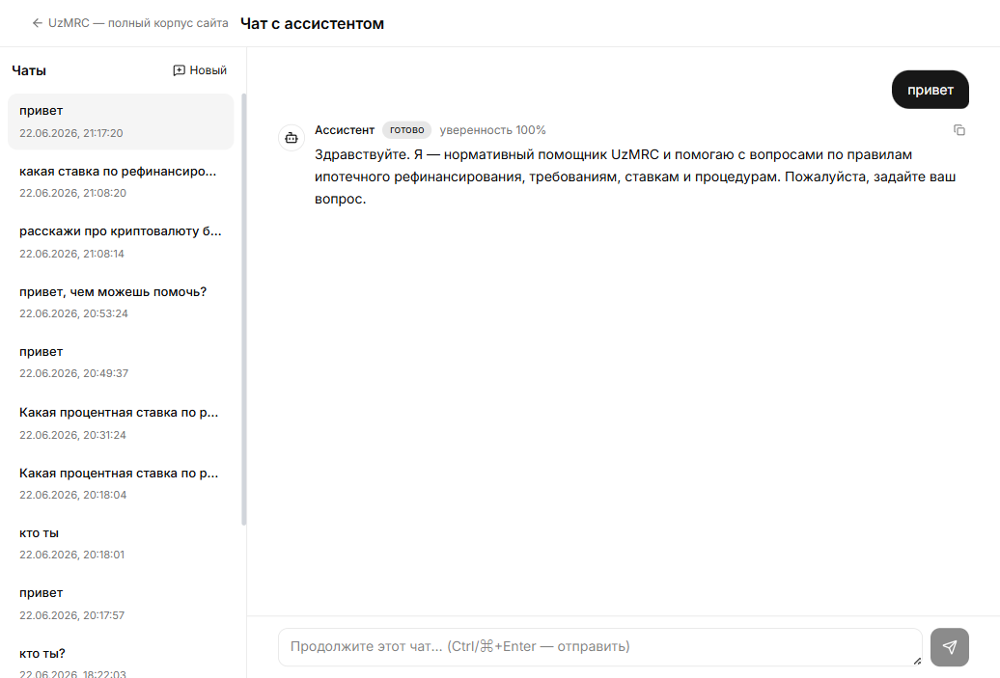
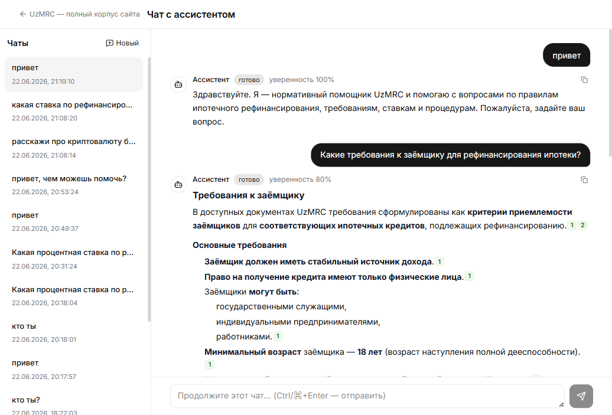
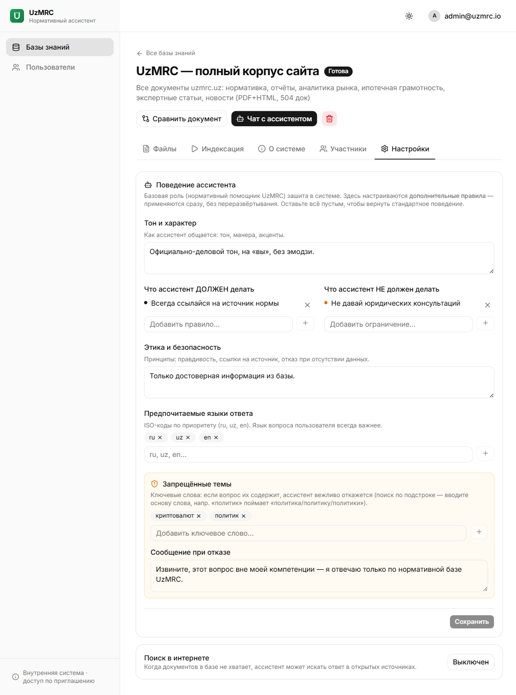
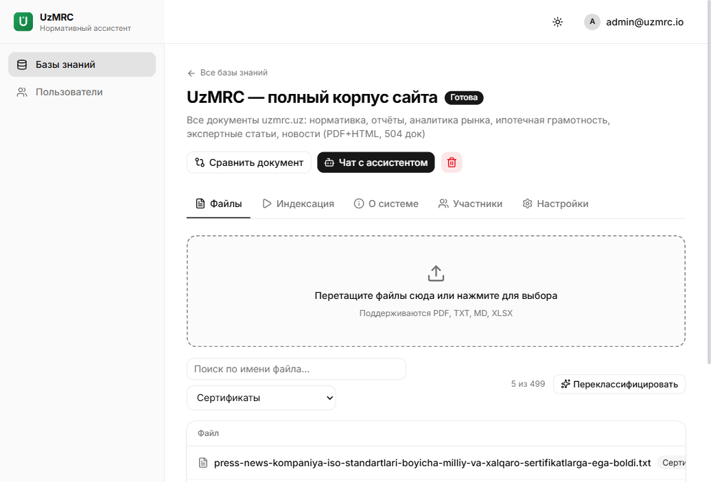

# UzMRC — Изменения 2026-06-22 (одностраничная документация)

**Прод:** https://89.167.15.225.sslip.io · **Логин:** `admin@uzmrc.io`
**RAG:** `86e90882…` (полный корпус, 499 файлов) · **Репо:** Yersultan04/uzmrc

---

## 1. Чек-лист задач сессии vs выполнение

| # | Задача (запрос) | Статус | Где / как |
|---|-----------------|--------|-----------|
| 1 | Бот эскалирует на «привет/кто ты» («уверенность 0%, передал человеку») | ✅ | Класс `smalltalk` в роутере → тёплый персона-ответ, без эскалации |
| 2 | Использовать нормальную модель, не дешёвую | ✅ | gpt-5.4 → затем **gpt-4o** (баланс скорость/качество) |
| 3 | Взять паттерны из админки Эльзы | ✅ | Двухуровневая персона + casual-routing + AIConfig перенесены |
| 4 | Грейсфул «нет в документах» вместо страшной эскалации | ✅ | FINAL с вежливым текстом; мягкий UI |
| 5 | Строгое разделение языков (без «practically» в русском) | ✅ | LANGUAGE RULES (как у Эльзы): ответ целиком на языке юзера |
| 6 | Дефолтная персона «официально-деловой тон» | ✅ | Прод-дефолт: офиц-тон, на «вы», без эмодзи |
| 7 | Редактируемая персона через админку | ✅ | Вкладка **Настройки** базы |
| 8 | Полный AI Config (что избегать / что нет, как у Эльзы) | ✅ | Тон · Должен · Не должен · Этика · Языки · Запрещённые темы |
| 9 | Проверить работу через Playwright | ✅ | E2E: привет, кто ты, документный вопрос, restricted, фильтр типов |
| 10 | Ускорить ассистента («долго думает») | ✅ | ~80с → **11–15с** (документный), **4с** (привет) |
| 11 | Грязные файлы: найти и почистить | ⚠️ Частично | Отчёт готов (20 сканов); **OCR отложен по решению юзера** |
| 12 | Классифицировать документы по типу | ✅ | 499/499 за 61с + бейдж/фильтр в UI |

**Итого: 11 из 12 полностью; OCR сканов сознательно отложен (дорого, не блокирует).**

---

## 2. Что нового для пользователя (админ-панель)

**База → вкладка «Настройки» → «Поведение ассистента»** (видно владельцу):
- **Тон и характер** — как общается ассистент.
- **Что ДОЛЖЕН / НЕ должен делать** — списки правил.
- **Этика и безопасность** — принципы (правдивость, ссылки на источник).
- **Предпочитаемые языки** — ISO-коды (ru, uz, en).
- **Запрещённые темы** — ключевые слова → вежливый отказ без поиска (вводить *основу* слова: «политик» ловит «политика/политику»). + своё **сообщение отказа**.
- Применяется **сразу, без переразвёртывания**. Пусто = стандартное поведение.

**База → вкладка «Файлы»:**
- У каждого файла — **бейдж типа**; вверху **фильтр по типу** и кнопка **«Классифицировать»**.
- Типы: Нормативные · Отчёты · Аналитика рынка · Новости/пресс · Эмиссия/инвесторам · Сертификаты · Бизнес-планы · О компании · Прочее.

---

## 3. Скриншоты (живой прод)

| Сценарий | Скриншот |
|----------|----------|
| Приветствие → персона UzMRC (готово, 100%, без эскалации) |  |
| Документный вопрос → ответ с цитатами [1][2], офиц-тон |  |
| Редактор «Поведение ассистента» (Тон · Должен/Не должен · Этика · Языки · Запрещённые темы) |  |
| Файлы: бейджи типов + фильтр (Сертификаты → 5 из 499) |  |

---

## 4. Технические детали

**Маршрутизация моделей (per-RAG, `rags.settings.models`):**
- chat/финал: `openai/gpt-4o` (OpenRouter) · rerank: `gpt-oss-120b` (дёшево, by design) · vision: `qwen3-vl`.
- **Почему реранк дешёвый:** реранк = *оценка релевантности* и пересортировка чанков, а не генерация. Дешёвая крепкая модель ранжирует не хуже дорогой; качество ответа даёт chat-модель (gpt-4o). Инструмент `rerank_pool` опционален и при сбое возвращает исходный порядок (грейсфул). Для «настоящего» реранка есть Voyage `rerank-2.5` (модуль сравнения).
- Гибрид (`AGENT_STEP_MODEL`, по умолчанию OFF) — быстрые шаги + качественный финал; включать только для медленных reasoning-моделей (gpt-5.4).
- Шаги идут через OpenRouter (не Cerebras free-tier — он давал 429 + 59с backoff).

**Ключевые файлы:** `agent/router.py` (smalltalk), `agent/prompts.py` (персона, LANGUAGE RULES, `build_admin_instructions`, `check_restricted_topics`), `agent/loop.py` (short-circuit, гибрид), `api/rags.py` (PATCH ai_config), `api/files.py` (classify), `ingestion/classify.py`, `models.py` (`files.doc_type`, миграция 0010).

**Хранение настроек:** `rags.settings.ai_config` (структура) + `files.doc_type` (тип документа).

---

## 5. Деплой и откат

- **Сервер:** Hetzner `89.167.15.225`, репо `/opt/uzmrc/rag-cms` (не git).
- **Деплой:** `scp` файлов + `docker compose -f docker-compose.prod.yml [-f docker-compose.next.yml] up -d --build <svc>` (бэкенд сам делает `alembic upgrade head`).
- **Откат:** серверные бэкапы в `.rollback/<TS>/`, дамп БД в `backups/`.
- **Коммиты сессии:** `becafa5` → `0a5f4b7` (8 шт.), запушены в `main`.

---

## 6. Грязные файлы (отчёт, для справки)

20 пустых сканов без текстового слоя (NAPS2): квартальные `Nch/Q*UZ20YY`, аудиты (`2020audit`, `ZaminOilAudit`, `Odil-Audit-KPI`), `certificate-iso`, приказы `_ksiyalari…`, `Qaror91221`, `uzA.Ahborreyting`. Сейчас помечены типом, но пустые в индексе. **Чистка = OCR** (vision-модель, ~20–40 мин) — запускать отдельно при необходимости (рекомендация: только отчёты/приказы, пропустить тяжёлые аудиты).
